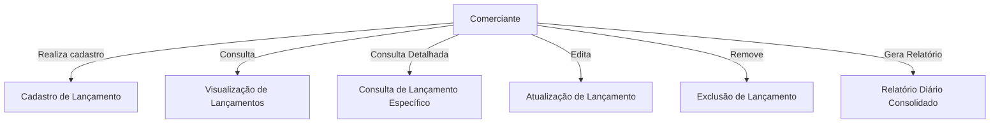

# VerityMoney API

## Visão Geral
A **VerityMoney API** é uma API RESTful desenvolvida em **.NET 6.0** para gerenciamento de fluxo de caixa de comerciantes. Permite a criação de lançamentos financeiros (**débito e crédito**) e gera relatórios diários consolidados de saldo.

---
## Requisitos do Sistema

### Requisitos Funcionais

- O sistema deve permitir que comerciantes realizem lançamentos financeiros, tanto de **débito** quanto de **crédito**.
- O sistema deve fornecer uma interface para a visualização de todos os lançamentos cadastrados.
- O sistema deve permitir a consulta detalhada de um lançamento específico.
- O sistema deve possibilitar a atualização de lançamentos previamente cadastrados.
- O sistema deve permitir a remoção de lançamentos existentes.
- O sistema deve fornecer um relatório diário consolidado do saldo a partir de uma data específica.

### Requisitos Não Funcionais

- O sistema deve ser desenvolvido em **C# com .NET 6.0**, seguindo o padrão **RESTful API**.
- O sistema deve contar com **testes unitários** para garantir a qualidade e segurança das entregas.
- O sistema deve adotar boas práticas de desenvolvimento, incluindo uma arquitetura que segrega adequadamente a camada de domínio.

### Requisitos de Domínio

- O sistema deve ser capaz de calcular corretamente os saldos com base nos lançamentos cadastrados.
- O sistema deve distinguir de forma clara os lançamentos de **débito** e **crédito**, garantindo cálculos financeiros precisos.
- O saldo calculado a partir dos lançamentos deve ser consolidado e apresentado em relatórios financeiros diários.

---
## Casos de Uso

Os casos de uso do **VerityMoney API** abrangem as principais interações do comerciante com o sistema:



---
## Modelo Conceitual

O modelo conceitual do **VerityMoney API** é estruturado com os seguintes principais componentes:

- **Usuário:** Responsável por realizar os lançamentos financeiros.
- **Lançamento:** Representa uma transação financeira que pode ser de **débito** ou **crédito**.
- **Saldo Diário:** Representa o valor consolidado dos lançamentos financeiros em um determinado dia.
- **Relatório Financeiro:** Documento gerado com base nos cálculos dos lançamentos, fornecendo um panorama da situação financeira do comerciante.


---
## Execução do Projeto

### Executando diretamente no ambiente local

1. Acesse a pasta **VerityMoney.Api**.
2. Execute o seguinte comando:
   ```sh
   dotnet run
   ```
3. Alternativamente, abra o projeto no **Visual Studio** e clique no botão **Play**.
4. Acesse a documentação da API pelo **Swagger**:
   ```
   http://localhost:5201/swagger
   ```

É possível testar todas as operações da API diretamente pelo Swagger.

### Executando via Docker

1. Certifique-se de que o **Docker** e o **Docker Compose** estão instalados.
2. Execute o seguinte comando na raiz do projeto:
   ```sh
   docker-compose up
   ```
3. A API estará acessível em:
   ```
   http://localhost:3200
   ```
4. Acesse o **Swagger** para testes:
   ```
   http://localhost:3200/swagger
   ```

Durante os testes via API, os tipos de lançamento são representados por **enums**:
   - `CREDITO = 0`
   - `DEBITO = 1`

Coleção do Postman disponível para facilitar os testes:
[Postman Collection](https://restless-star-501117.postman.co/workspace/Team-Workspace~4d019a1c-3ab2-4147-8cd1-760e04194bbd/collection/11187091-9f718bf9-da12-4106-a675-f0c18fb1fd3b?action=share&creator=11187091)

---
## Testes Unitários

Para rodar os testes unitários, execute o seguinte comando na pasta **VerityMoney.Specs**:
```sh
dotnet test
```

---
## Tecnologias e Padrões Utilizados

- **C# com .NET 6.0**
- **Entity Framework Core**
- **Arquitetura DDD (Domain-Driven Design)**
- **Princípios SOLID**
- **Testes Unitários**
- **Docker para containerização**

---
## Licença

Este projeto está sob a licença **MIT**.


